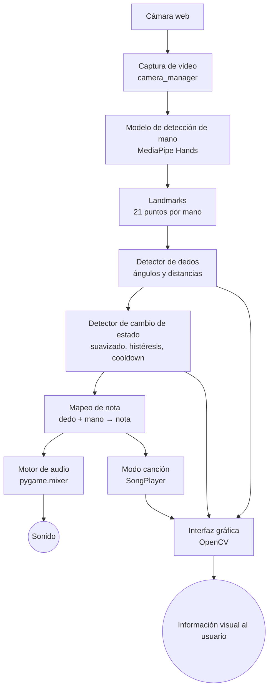

# FingerMusic

**Instrumento musical virtual mediante visión por computador**


## Descripción

FingerMusic convierte la cámara web del portátil en un instrumento musical. Un modelo
de inteligencia artificial preentrenado (MediaPipe Hands) localiza los 21 puntos de
referencia (*landmarks*) de la mano; el programa calcula con geometría si cada dedo está
extendido o flexionado y, cuando un dedo pasa de **extendido a flexionado**, reproduce la nota
asignada. Con ello se puede interpretar una versión simplificada de **Jingle Bells** sin teclado,
mouse ni instrumento físico.

## Objetivo

Desarrollar una aplicación de visión por computador que detecte en tiempo real la flexión de los
dedos, la convierta en eventos musicales y permita tocar una melodía sencilla, usando un modelo
preentrenado (sin entrenar ninguna red desde cero).

## Características

- Detección de hasta **dos manos** en tiempo real con un modelo preentrenado.
- **10 notas** (DO4 a MI5): mano izquierda = DO–SOL, mano derecha = LA–MI'.
- Detección de flexión por **ángulos y distancias** (no por una simple comparación de coordenadas).
- **Transición de estado** EXTENDIDO → FLEXIONADO: una nota por pulsación, sin repeticiones.
- Suavizado, histéresis, confirmación por frames y cooldown configurables.
- **Calibración** de la posición de reposo de cada usuario.
- **Modo libre** y **modo canción** (Jingle Bells) con nota actual, siguiente, progreso y acierto/error.
- Audio sin Internet y **sin material con copyright**: los tonos se generan por síntesis.
- Interfaz con botones, atajos de teclado, estado de cada dedo y landmarks dibujados.
- Manejo de errores (cámara, modelo, audio) con mensajes claros, logging y pruebas automáticas.

## Tecnologías utilizadas

| Componente | Tecnología |
|---|---|
| Lenguaje | Python 3.11 |
| Captura e interfaz | OpenCV (`opencv-contrib-python`) |
| Modelo de IA | MediaPipe Hands (Google) |
| Cálculo | NumPy |
| Audio | pygame (`pygame.mixer`) |
| Pruebas / calidad | pytest, ruff |

## Modelo de IA

Se usa **MediaPipe Hands**, desarrollado por **Google** (equipo de MediaPipe), preentrenado y
distribuido con licencia Apache 2.0. Detecta la mano y devuelve 21 landmarks 3D. **No se entrena
nada.** Todo el detalle (qué parte es IA y cuál es lógica programada, limitaciones, etc.) está en
[docs/modelo_ia.md](docs/modelo_ia.md).

## Arquitectura



Más detalle en [docs/arquitectura.md](docs/arquitectura.md).

## Requisitos

- Windows 10/11 (también funciona en otros sistemas con cámara y audio).
- Python **3.11** (se probó también con 3.12).
- Cámara web y altavoces/auriculares.
- Visual Studio Code (recomendado) con la extensión *Python*.

## Instalación

Desde una terminal en la carpeta del proyecto:

```
python -m venv .venv
.venv\Scripts\activate
pip install -r requirements.txt
```

En VS Code: `Ctrl+Shift+P` → **Python: Select Interpreter** → `.venv\Scripts\python.exe`.
Si PowerShell bloquea la activación: `Set-ExecutionPolicy -Scope CurrentUser RemoteSigned`.
Guía completa: [docs/instalacion.md](docs/instalacion.md).

## Configuración

Todos los parámetros están en `src/fingermusic/config/settings.py`; no se necesita archivo `.env`.

| Parámetro | Clase | Para qué sirve |
|---|---|---|
| `index`, `width`, `height`, `fps`, `mirror` | `CameraSettings` | Cámara y resolución |
| `flex_on_threshold` / `flex_off_threshold` | `DetectionSettings` | Umbrales de histéresis (sensibilidad) |
| `state_confirmation_frames` | `DetectionSettings` | Frames para confirmar un cambio |
| `note_cooldown` | `DetectionSettings` | Segundos mínimos entre dos notas del mismo dedo |
| `smoothing_alpha` | `DetectionSettings` | Suavizado (menor = más suave, más lento) |
| `pip_angle_*`, `reach_ratio_*`, `thumb_*` | `DetectionSettings` | Rangos geométricos de flexión |
| `volume`, `buffer_size` | `AudioSettings` | Volumen inicial y latencia |

Las notas están en `audio/notes.py` y la canción en `music/jingle_bells.py`.
Detalles en [docs/funcionamiento.md](docs/funcionamiento.md).

## Ejecución

```
python run.py
```

Alternativas: `python -m fingermusic` (con `PYTHONPATH=src`), o **F5** en VS Code (usa `.vscode/launch.json`).
Opciones: `--camera N` (otra cámara), `--swap-hands`, `--debug`, `--regenerate-sounds`.

## Uso

1. Ejecuta el programa y permite el acceso a la cámara.
2. Coloca la mano abierta frente a la cámara, a unos 40–70 cm, con buena luz y la palma hacia ella.
3. Pulsa **C** (calibrar) y mantén la mano abierta y quieta 2 segundos.
4. Flexiona un dedo y vuelve a extenderlo: suena su nota.

## Controles

| Botón | Tecla | Acción |
|---|---|---|
| MODO LIBRE | `1` | Toca cualquier nota |
| MODO CANCION | `2` | Jingle Bells guiado |
| REINICIAR | `R` | Reinicia la canción |
| CALIBRAR | `C` | Calibra la mano abierta (2 s) |
| CAMARA ON/OFF | `Espacio` | Inicia o detiene la cámara |
| PUNTOS SI/NO | `L` | Muestra/oculta landmarks |
| SONIDO SI/NO | `S` | Activa/desactiva el sonido |
| CAMBIAR MANOS | `H` | Intercambia las notas de las manos |
| VOL − / VOL + | `-` / `+` | Volumen |
| SALIR | `Q` / `Esc` | Cierra la aplicación |

## Cómo tocar una nota

Con la mano abierta, **dobla un dedo hacia la palma y vuelve a abrirlo**. La nota suena en el
instante en que el dedo pasa de extendido a flexionado; mantenerlo abajo no repite la nota.

| Dedo | Mano izquierda | Mano derecha |
|---|---|---|
| Pulgar | DO | LA |
| Índice | RE | SI |
| Medio | MI | DO' |
| Anular | FA | RE' |
| Meñique | SOL | MI' |

Con **una sola mano** tienes 5 notas (DO–SOL con la izquierda; con `H` o `--swap-hands` también
con la derecha). Para las 10 notas se usan las dos manos. Jingle Bells solo necesita DO–SOL.

## Modo libre

Cualquier nota se puede tocar en cualquier momento. La nota que suena se resalta en el panel
lateral y en la tarjeta del dedo correspondiente.

## Modo Jingle Bells

Pulsa `2`. El panel muestra **NOTA ACTUAL**, **SIGUIENTE**, `Nota n / total` y una barra de
progreso. Si tocas la nota correcta aparece **ACIERTO!** (borde verde) y se avanza; si tocas otra,
**ERROR** (borde rojo) y no se avanza. `R` reinicia. Detalle en [docs/jingle_bells.md](docs/jingle_bells.md).

## Estructura del proyecto

```
FingerMusic/
├── run.py                  # lanzador (python run.py)
├── src/fingermusic/
│   ├── main.py             # argumentos, logging, manejo de errores globales
│   ├── app.py              # bucle principal: cámara → modelo → motor → audio → UI
│   ├── engine.py           # landmarks → eventos musicales (sin cámara ni audio)
│   ├── camera/             # captura de video
│   ├── vision/             # landmarks, MediaPipe, detección de dedos
│   ├── audio/              # notas, síntesis de tonos, reproducción
│   ├── music/              # Jingle Bells y seguimiento de la canción
│   ├── ui/                 # interfaz OpenCV
│   ├── config/             # parámetros centralizados
│   └── utils/              # funciones matemáticas y logging
├── tests/                  # pytest (83 pruebas)
├── assets/sounds/          # 10 notas .wav generadas por el propio programa
├── docs/                   # documentación técnica
└── screenshots/            # capturas para la demostración
```

## Funcionamiento de la detección de dedos

Para cada dedo se calcula una **puntuación de flexión** entre 0 (extendido) y 1 (flexionado) que
combina el **ángulo en la articulación PIP** y el **alcance** (distancia punta–muñeca dividida por
distancia base–muñeca); el pulgar usa su propia medida. Luego la puntuación se **suaviza**, se
compara con **dos umbrales** (histéresis), se **confirma durante varios frames** y se respeta un
**cooldown**. Solo la transición EXTENDIDO → FLEXIONADO genera la nota. Las fórmulas están en
[docs/deteccion_dedos.md](docs/deteccion_dedos.md).

## Reproducción de audio

Los 10 tonos se **sintetizan** (armónicos + envolvente) y se guardan como `.wav` en
`assets/sounds/`, de modo que no hay material con derechos de autor ni dependencia de Internet.
`pygame.mixer` los reproduce con un buffer de 256 muestras y 16 canales (notas simultáneas).
Si faltan los `.wav`, se regeneran solos. Ver [docs/reproduccion_audio.md](docs/reproduccion_audio.md).

## Demostración

1. Abre Visual Studio Code en la carpeta `FingerMusic`.
2. Activa el entorno: `.venv\Scripts\activate`.
3. Ejecuta `python run.py` (o pulsa F5).
4. Permite el acceso a la cámara si Windows lo solicita.
5. Coloca la mano abierta frente a la cámara.
6. Espera a que aparezcan los landmarks y la tarjeta *MANO IZQUIERDA* se active.
7. Prueba el **modo libre** flexionando cada dedo.
8. Pulsa `2` para entrar al **modo Jingle Bells**.
9. Sigue la nota mostrada en **NOTA ACTUAL**.
10. Flexiona el dedo correspondiente; la barra de progreso avanza.

Espacio reservado para material de la demostración (añádelo tú; no se incluyen capturas inventadas):

<!--  -->
<!--  -->
<!--  -->
<!-- Video: https://... -->

## Guía para la exposición

- **Problema:** ¿cómo tocar una melodía sin un instrumento físico?
- **Solución:** visión por computador que detecta el movimiento de los dedos y lo convierte en eventos musicales.
- **Tecnologías:** Python + OpenCV + MediaPipe Hands + pygame.
- **Inteligencia artificial:** modelo preentrenado de landmarks de mano (solo localiza puntos).
- **Procesamiento:** cámara → imagen → modelo → landmarks → geometría → estado del dedo → nota → audio.
- **Resultado:** interpretación de Jingle Bells en tiempo real.
- **Qué es IA y qué es lógica programada:** la IA solo entrega los 21 puntos; ángulos, umbrales, estados, notas y canción son lógica propia.

## Solución de problemas

Resumen (completo en [docs/troubleshooting.md](docs/troubleshooting.md)):

- **No abre la cámara:** cierra Zoom/Teams/Cámara de Windows; revisa *Configuración → Privacidad → Cámara*; prueba `--camera 1`.
- **No suena nada:** revisa el volumen de Windows y la tecla `S`; la barra inferior indica "Sin audio" si no hay dispositivo.
- **Notas que se disparan solas o no se disparan:** calibra con `C` y ajusta `flex_on_threshold` / `flex_off_threshold`.
- **`ModuleNotFoundError`:** el entorno no está activado o falta `pip install -r requirements.txt`.

## Limitaciones

- Los umbrales por defecto son estimaciones geométricas; **se deben ajustar con manos reales** (calibración y `settings.py`). Ver *Estado de validación*.
- Funciona con la palma hacia la cámara; con la mano de canto o muy inclinada la flexión se confunde.
- Con poca luz, fondos confusos u oclusión el modelo puede perder la mano.
- El pulgar flexiona hacia la palma (no "hacia abajo"), por lo que es el dedo más difícil de medir.
- Las 10 notas requieren dos manos; con una sola mano hay 5.
- La interfaz no muestra tildes ni la ñ (limitación de las fuentes de OpenCV).
- Se usa la API clásica `mediapipe.solutions` fijada en `mediapipe==0.10.21` (Google la considera *legacy*).

## Mejoras futuras

- Migrar a la API *Hand Landmarker* (MediaPipe Tasks) cuando se pueda distribuir el modelo `.task`.
- Más canciones, acordes y selección de instrumento/timbre.
- Calibración también de la mano cerrada (rango completo por dedo).
- Interfaz con Tkinter/PySide para texto con tildes y más controles.
- Medir la latencia extremo a extremo.

## Pruebas

```
pip install -r requirements-dev.txt
pytest
ruff check .
```

Hay 83 pruebas que cubren: geometría de flexión, cambios de estado (histéresis, cooldown,
confirmación), calibración, conversión de landmarks, mapeo dedo → nota, secuencia y avance de
Jingle Bells, reinicio, configuración, síntesis y gestor de audio (con el driver `dummy`).
Las pruebas usan manos sintéticas con geometría coherente; **no usan la cámara real**.

## Estado de validación

Verificado en el entorno de desarrollo (Linux, Python 3.12, pantalla virtual Xvfb, sin cámara ni audio físicos):

- ✅ Entorno virtual, instalación de `requirements.txt` y 83 pruebas aprobadas; `ruff` sin errores.
- ✅ El modelo MediaPipe Hands carga y procesa frames.
- ✅ La aplicación inicia, abre la ventana, cambia de modo, calibra, activa/detiene la cámara y se cierra con código 0 (con una cámara simulada solo para esta verificación).
- ✅ Sin cámara, muestra un mensaje claro y no se cierra.
- ✅ Los 10 `.wav` se cargan en `pygame.mixer` (driver `dummy`).

**No verificado** (requiere hardware real; probar en tu portátil):

- ⚠️ Detección sobre una **mano real** y ajuste de los umbrales con personas reales.
- ⚠️ **Sonido audible** y su latencia real en Windows.
- ⚠️ Ejecución en **Windows con Python 3.11** (las versiones de `requirements.txt` tienen ruedas para esa plataforma, pero no se instalaron allí).
- ⚠️ Clonar desde GitHub: se verificó una copia limpia del proyecto, no un clon real del repositorio.

## Autor

**Andi Lin**
Ingeniería de Sistemas
Universidad Autónoma de Bucaramanga (UNAB)
