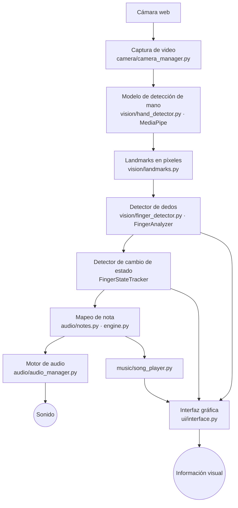

# Arquitectura

## Flujo de datos

## Módulos y responsabilidades

| Módulo | Responsabilidad | Depende de cámara/audio/UI |
|---|---|---|
| `camera/camera_manager.py` | Abrir, leer (espejado) y liberar la cámara | Sí (OpenCV) |
| `vision/hand_detector.py` | Envolver MediaPipe y devolver `HandLandmarks` | MediaPipe |
| `vision/landmarks.py` | Índices, tipos y conversión normalizado → píxeles | No |
| `vision/finger_detector.py` | Puntuación de flexión, máquina de estados, calibración | No |
| `engine.py` | Landmarks → notas; modos; canción; calibración | No |
| `audio/notes.py`, `synth.py` | Las 10 notas y su síntesis | No |
| `audio/audio_manager.py` | Cargar y reproducir sonidos | pygame |
| `music/` | Jingle Bells y `SongPlayer` | No |
| `ui/interface.py` | Dibujo y eventos de ventana | OpenCV |
| `app.py` | Orquesta todo en el bucle principal | Todos |
| `config/settings.py` | Parámetros centralizados e inmutables | No |

**Decisión clave:** `engine.py` y `vision/finger_detector.py` no importan cámara, audio ni interfaz.
Por eso toda la lógica de detección, transiciones, notas y canción se prueba automáticamente
con manos sintéticas.

## Bucle principal (`app.py`)

1. Leer un frame de la cámara (ya espejado).
2. `HandDetector.detect()` → lista de `HandLandmarks` (máx. una por lado).
3. `MusicEngine.process()` → lecturas de los dedos y `PlayedNote`s.
4. Por cada nota: `AudioManager.play()`, resaltar en la UI, registrar acierto/error.
5. `Interface.render()` + `show()`, y procesar teclado/ratón.

## Manejo de errores

| Situación | Comportamiento |
|---|---|
| Cámara inexistente, ocupada o sin permiso | Mensaje en pantalla; la app sigue abierta; `Espacio` reintenta |
| Cámara se desconecta | Tras `max_read_failures` frames fallidos se detiene y avisa |
| No hay mano | Se muestra "Coloca la mano…"; los estados se reinician tras `hand_lost_reset_frames` |
| Dos manos | Se admiten; si el modelo repite un lado, se queda la de mayor confianza |
| Modelo no carga / mediapipe ausente | Mensaje claro y salida con código 1 |
| `.wav` ausente | Se regenera automáticamente; si falla, se registra y la nota queda muda |
| Sin dispositivo de audio | `Sin audio` en la barra inferior; la app sigue funcionando |
| Error inesperado | Se registra en `logs/fingermusic.log` y se muestra un mensaje sin traceback |
